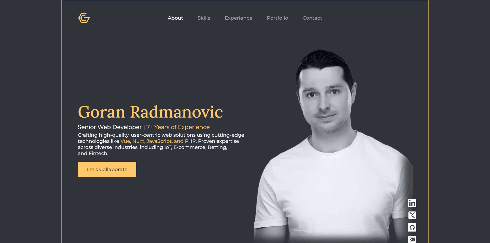
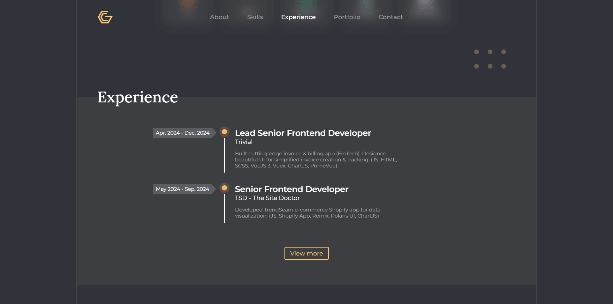
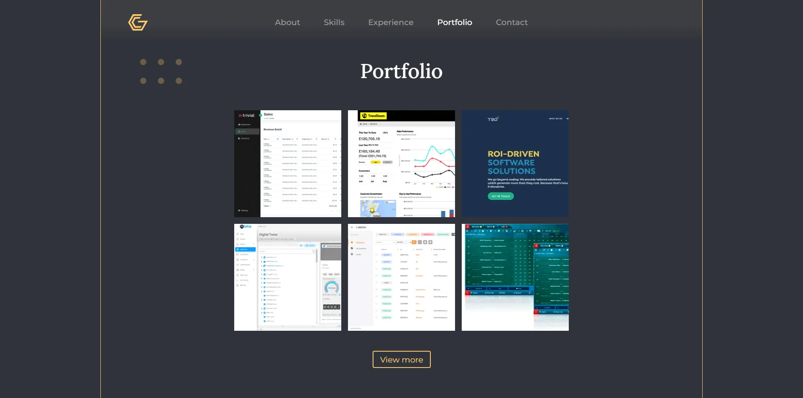
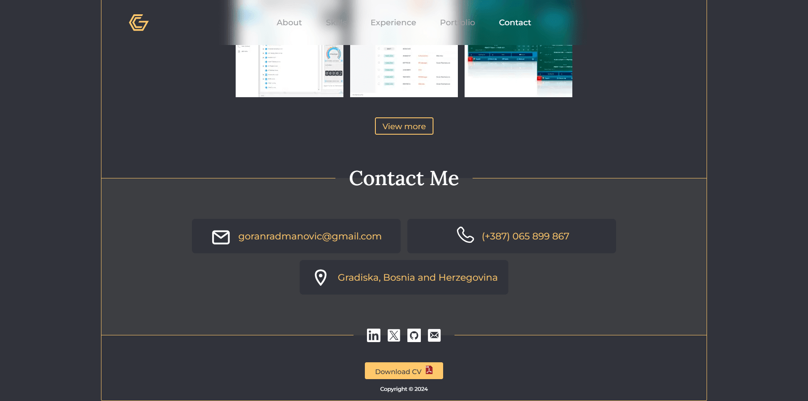
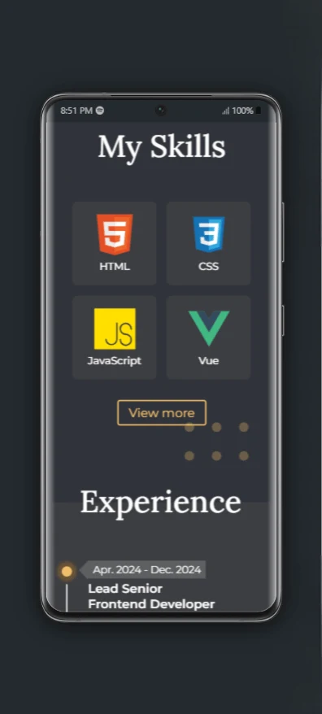

# Welcome to My Portfolio 🌟  

Hello! I'm Goran Radmanovic, a passionate web developer dedicated to crafting modern, efficient, and user-friendly web experiences. This portfolio showcases my latest project, which I built using cutting-edge web technologies.  

🌐 **Visit My Portfolio:** [goranradmanovic.github.io](https://goranradmanovic.github.io)  

## Key Features of My Portfolio  

- **Core Technologies:**  
  Designed and developed with **HTML**, **CSS**, and **JavaScript**, leveraging the power of native **Web Components** for modular and reusable design.  

- **Progressive Web App (PWA):**  
  Fully optimized as a PWA, offering offline capabilities and a seamless app-like experience.  

- **Service Workers:**  
  Implemented **Service Workers** to enhance performance and reliability, ensuring fast load times and offline functionality.  

- **SEO-Friendly:**  
  Meticulously optimized for search engines with semantic HTML, structured metadata, and fast loading speeds to maximize discoverability.  

- **Optimized Images:**  
  Used modern **WebP** image formats to achieve high-quality visuals while keeping the website lightweight and fast.  

- **Responsive Design:**  
  Ensured a flawless user experience across all devices with a fully responsive layout.  

- **Performance-Driven:**  
  Focused on delivering a fast, efficient, and engaging web experience by employing best practices and performance optimizations.  

Feel free to explore my work, and don't hesitate to reach out if you'd like to collaborate! 🚀

🌐 **Screenshot Of My Portfolio**

Desktop version
---

---

Mobile version
---

---